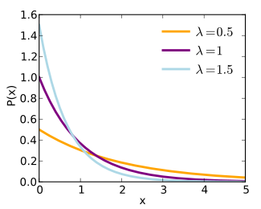
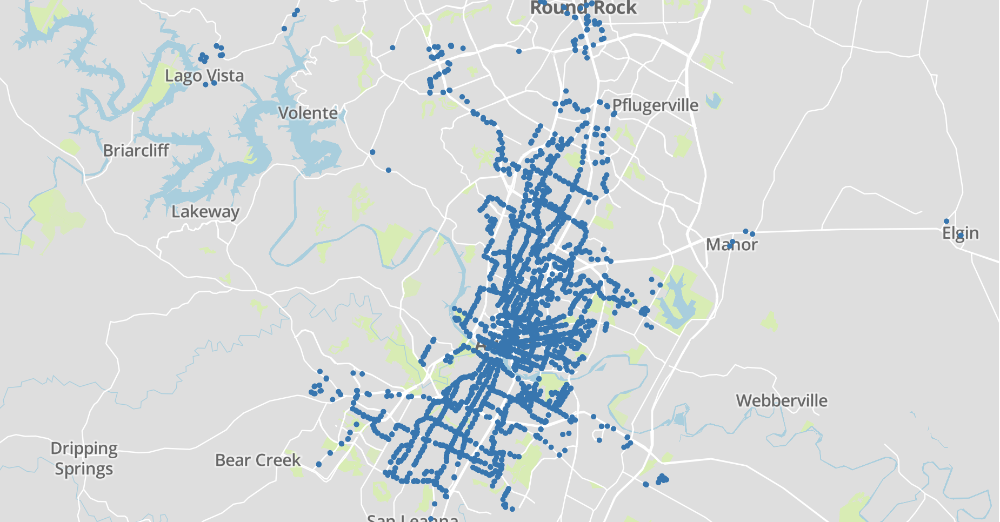
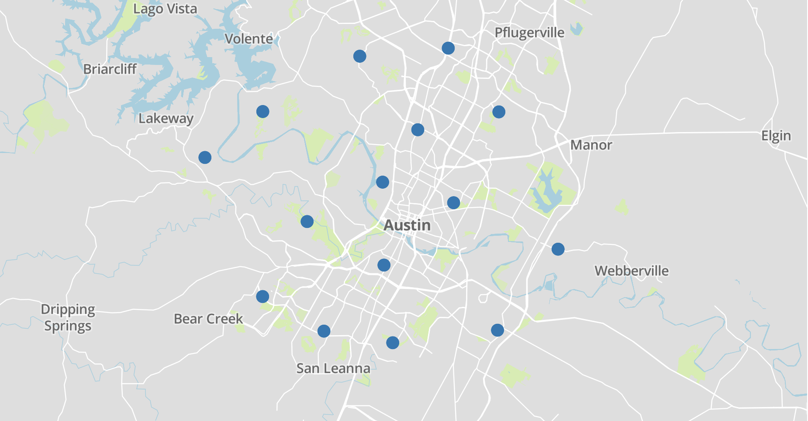
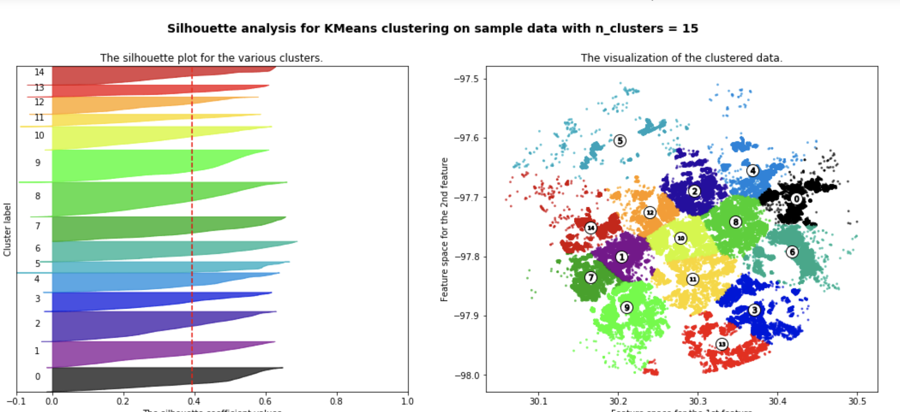
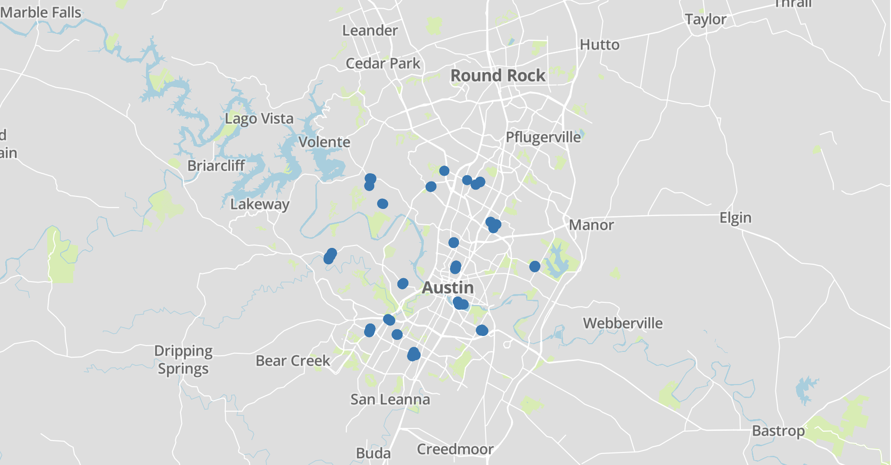

# Project Overview and Walkthrough

My intentions in starting this project were to use data to address the homelessness problem that many cities grapple with.
I currently live in Austin, TX and it is an example of a rapidly growing metropolis with increasing cost of living and
housing prices. This has a direct impact on homelessness populations. If you live in the area or have ever driven through
it's difficult to miss the panhandlers and vagrants on most major streets throughout the day.

My approach was to see if I could use the data to improve city planning and policy efforts, which I deemed to be a potentially
impactful approach. Austin currently has low income housing programs and I attempted to use geospatial data to improve
planning for these projects. In particular, I sought to address the question: "Can I identify the best houses to buy
within the city of Austin for a low income housing program?"

To address the problem I needed to acquire local property data and engineer features that would be relevant to a program.
Finally, I plotted my picks for the best houses and used visualization to help understand how those were generated by my 
model.

## Data acquisition

### Trulia and Scrapy

I began my work with the help of another project featured in the <a href='https://nycdatascience.com/blog/student-works/scraping-trulia-zillow/'>NYC Data Science Academy blog</a> that detailed both an approach to scraping zillow using selenium
as well as a trulia spider using the scrapy library. I had never seen the scrapy library and the article (written in 2017)
made the process of scraping Trulia seem simple. To make a long and somewhat frustrating story shorter, Trulia does a very
good job of protecting their data (which makes sense given that scraping is against their terms of service). They had also
made changes to how they stored data on their listing pages to where I needed to heavily modify the spider in the original
post. 

Additionally, scrapy has functionality to throttle the delay on get requests in order to limit how much strain you spider
puts on the server. The AutoThrottle functionality that comes with scrapy adjusts request timing based on download latency
and so this doesn't mimick human browsing behavior closely. To achieve that, I borrowed from another <a href='https://mikulskibartosz.name/making-your-scrapy-spider-undetectably-by-applying-basic-statistics-feba515ab04c'>article on 
medium written by Bartosz Mikulski</a>. He modified the autothrottle functionality of scrapy to include delays based on
random variables sampled from the exponential distribution, which tend to create a pattern similar to human browsing. 

As you can see in the above, if we sampled random values from the distribution, most would have a shorter delay relatively
speaking, which intuition provides is human-like (as you're surfing the internet, you typically only pause for long periods
rarely and are otherwise fairly active).

Lastly, I used proxy servers to send get requests to the Trulia website which allowed me to use an IP address other than
the one on my home router. Trulia will very quickly block your requests if they can identify rapid and repeated requests 
from the same IP address. You can find free proxy servers via a simple google search and impliment them as I have done in
the <a href='src/scraping/trulia/middlewares.py'>middlewares utilities</a> located in the src folder in this repo. There
also you will find the 'RotateUserAgentMiddleware' class that I used to change the header on the get requests dynamically.
If you are new to scrapy, these middlewares and other settings on the spider get controlled by the <a href='src/scraping/trulia/settings.py'>settings file</a>, so I recommend parusing the <a href='src/scraping/trulia'>scraping folder</a> to familiarize 
yourself with the structure of a scrapy project, or you can read the <a href='https://docs.scrapy.org/en/latest/index.html'>documentation on their site.</a>

### Selenium

Using my spider, I was able to scrape nearly 700 home listings from Trulia, however they didn't come with latitudes and 
longitudes. So, for that I created a <a href='src/scraping/trulia/sel_scrape/selenium_latlong.py'>separate scraper using 
the selenium webdriver</a>. From there I was able to merge the coordinates with the original data and create a dataset with
coordinates as well as home values and other specifics!

### Boosting

At this point, I recognized that it was not possible to create an intelligent housing program based 
solely on only 700 homes worth of data. So, I leveraged the help of a colleague who had a dataset of 
a large majority of the addresses for properties in Austin, complete with zip codes. In total, the larger list of addresses
represented around 140,000 unique properties. My thought process was that I could use the trulia data to train a model 
and then regress specifications such as price per sqft onto the larger dataset. This makes sense because the price per
sqft is relatively stable with relation to location.

Using only latitudes, longitudes, and price per sqft, I took the <a href='https://scikit-learn.org/stable/modules/generated/sklearn.ensemble.GradientBoostingRegressor.html#sklearn.ensemble.GradientBoostingRegressor'>Gradient Boosting Regressor 
from sci-kit learn</a> and trained it on my trulia dataset. I was then able to regress the price per sqft onto the larger 
dataset. I then trained a new regressor using latitude, longitude, price per sqft, and price on the Trulia data and 
regressed the price data onto the larger dataset. I repeated this process for bedrooms and bathrooms as well. After boosting
I had a much larger dataset to work with. As an aside, I recognize this is a limitation to the specific conclusions of this
project, however it was necessary to get a larger dataset in order to test assumptions, and ballpark estimates would do for
my purposes. Having generated the data, I was ready to begin the process of feature engineering.

## Feature engineering

My next step was to address the problem at hand, which was to identify the best properties within the dataset for a low 
income housing program. Of obvious importance is price efficiency. Lower cost properties would obviously be better for 
any program that has a pre-defined budget. It also seemed relevant to explore other factors as a simple ranking of the 
price of properties in Austin would be both uninsightful and would likely result in a selection of properties far away 
from anything important (i.e. on the outskirts of town). Since we can assume that the potential occupants would likely be
financially limited, it made sense to favor properties that were close to public transportation. Additionally, in my 
research I found that modern low income housing programs have sought to disperse the controlled properties across an area
to avoid creating projects. Studies have shown that a concentration of this time of housing can lead to increased crime
and lower educational performance in those areas. So, it made sense to favor properties that were relatively dispersed 
across the city. 

### Price per sqft

As is unsurprising, a heatmap shows that prices are highest in the downtown area of Austin and decrease to the north and 
south. 

Price needed to be factored into the model and price per sqft was a better way to observe efficiency than total price. 
Price per bedroom was also considered, however there seemed to be little difference in favoring one metric over the other
and price per sqft is stable relative to location, so this was the metric of choice. 

### Distance to Public Transportation

The <a href='https://data.austintexas.gov/'>city of Austin open data portal</a> had a helpful dataset including the coordinates
to all bus stops within the city. I plotted those below to give an idea of what we were working with:

Given that I had access to the locations of bus stops and potential properties, I was
able to calculate the distance between each property and each bus stop and find the minimum distance to transportation for
each address. Given that I was using latitudes and longitudes, I used the haversine distance calculation which gives the
distance between two points on a great circle. This is the same as calculating the distance between two points on the 
surface of a sphere, which in this case was planet Earth. 

I have the functions I used for these calculations, along with other helper functions in the <a href='helper_functions/featuring_engineering.py'>helper functions folder</a> of this repo.

### Clustering

The third factor to include in the model was relative dispersion of the potential properties. To achieve this, I used the
<a href='https://scikit-learn.org/stable/modules/generated/sklearn.cluster.KMeans.html'>sci-kit learn K-Means clustering</a>
algorithm to cluster all the properties by only two dimension: latitude and longitude. This created a set of clusters that
groups properties by regions across Austin. Once I had these clusters I could take the centroids and use them as way points
to calculate the relative dispersion of properties across the city. Here are those centroids plotted on a map of Austin:

I used silhouette scoring to help me determine the number for k that made the most sense when clustering the properties
based on latitude and longitude. I'll let you read more into the specifics of the silhouette scoring in the <a href='https://scikit-learn.org/stable/auto_examples/cluster/plot_kmeans_silhouette_analysis.html'>sci-kit learn documentation</a> but
the gist is that it is a measure of cluster quality. To maximize the silhouette score is to maximize the similarity between
points within clusters. In running a few tests, I found that 15 clusters maximized the coherence of my clusters. Here is
the score plot that I generated using the sci-kit learn boilerplate:

Once I had the correct centroids located, I calculated the mean distance to centroid for each property and used this as a 
feature for the sake of the scoring model. Having addressed all three factors I began scoring and plotting the results.

## Scoring and plotting

In order to actually choose properties that maximize all three factors I listed, I needed a way to rank them. So, I decided
to normalize the values for price per sqft, minimum distance to public transportation, and distance to cluster centers.
This makes sense because the normalized values will fall between 0 and 1, representing the value relative to the other values
in the range. So, we can find the relative best options by maximizing the normalized values (for the purpose of min distance
to transportation we invert them by taking 1 -  the normalized value so that we are consistently trying to maximize scores).

Once that was done, I added all three normalized values together to get a score. I took the top 100 highest ranking properties
and plotted them on a map of Austin:

## Conclusion and Next Steps

Through the course of this project, I was able to answer the two main questions I posed before starting. Is geospatial data
useful for addressing low income housing program planning? I would argue yes, because it allowed us to consider relative
amenities as we are choosing properties which would be arguably important to the success of the program. The second question 
was whether we could use the data to choose the most prime properties and we were able to demonstrate that this is also 
possible. 